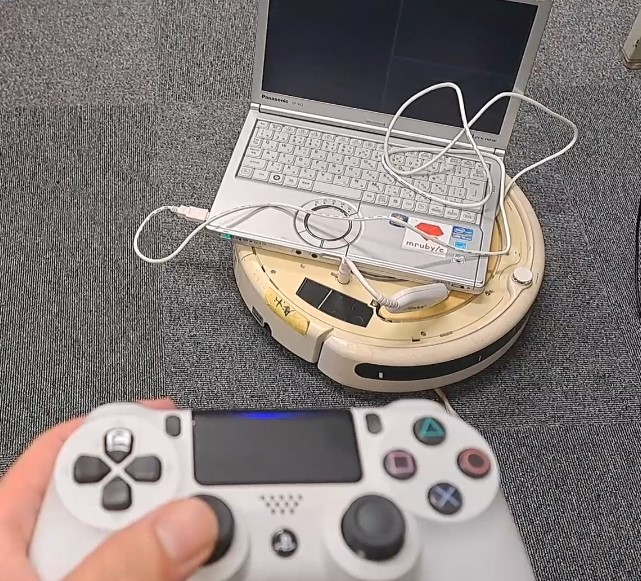
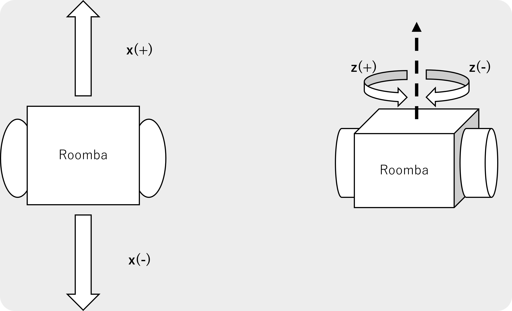
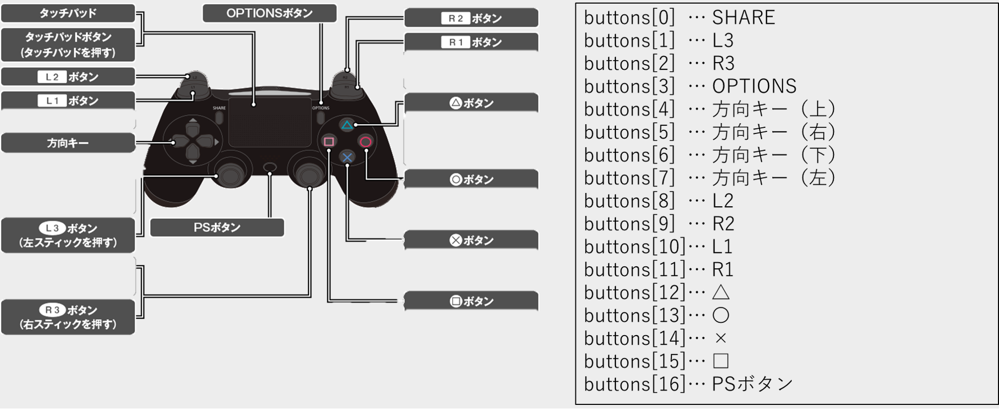
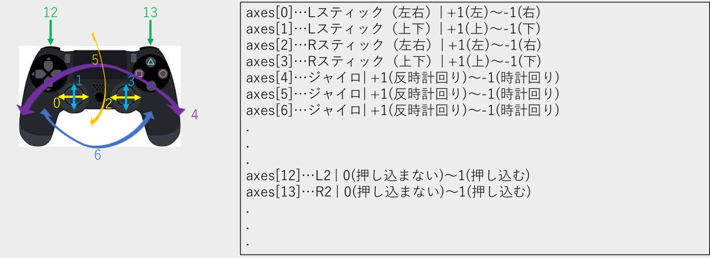
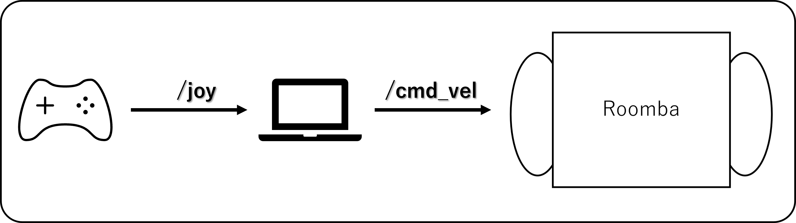

# Controlling a Roomba with ROS


# create_robot
[ROS](https://docs.ros.org)  driver for iRobot Create 1 and 2.

<!--[](* Documentation: TODO)-->
* ROS wiki page: http://wiki.ros.org/create_robot
* Author: Takuto Yamauchi

## Build Status
- ROS Noetic (branch: `noetic`) 

## Supported Robots

| Model     | Support    |
|-----------|------------|
| Roomba 500 Series |  Yes  |

## Install

#### Prerequisites

* Internet connection
* [ROS](http://wiki.ros.org/ROS/Installation)(noetic)
* Noetic only supports Python3
Ubuntu packages: `python3-rosdep`, `python3-catkin-tools`

    ``` bash
    sudo apt-get install python3-rosdep python3-catkin-tools
    ```

#### Compiling

1. Create a catkin workspace  
    ``` bash
    cd ~
    mkdir -p create_ws/src  
    cd create_ws  
    catkin init  
    ```

2. Clone this repo
    ``` bash
    cd ~/create_ws/src
    git clone https://github.com/autonomylab/create_robot.git --branch noetic
    ```
  
3. Install dependencies  
    ``` bash
    cd ~/create_ws
    rosdep update  
    rosdep install --from-paths src -i --rosdistro noetic 
    ```

4. Build
    ``` bash
    cd ~/create_ws
    catkin build
    ```
#### USB Permissions
1. In order to connect to Create over USB, ensure your user is in the dialout group
    ``` bash
    sudo usermod -a -G dialout $USER
    ```

2. Logout and login for permission to take effect

## Running the driver

### Setup

1. After compiling from source, don't forget to source your workspace:
    ``` bash
    cd
    source devel/setup.bash
    ```

2. After connecting the serial port to USB,
   ```bash
   cd
   sudo chmod +x /dev/ttyUSB0
   ```

### Launch files

For Create 2 (Roomba 500 series):
``` bash
roslaunch create_bringup create_2.launch
```


### Publishers

 Topic       | Description  | Type
-------------|--------------|------
 `battery/capacity` | The estimated charge capacity of the robot's battery (Ah) | [std_msgs/Float32][float32]
 `battery/charge` | The current charge of the robot's battery (Ah) | [std_msgs/Float32][float32]
 `battery/charge_ratio` | Charge / capacity | [std_msgs/Float32][float32]
 `battery/charging_state` | The chargins state of the battery | [create_msgs/ChargingState][chargingstate_msg]
 `battery/current` | Current flowing through the robot's battery (A). Positive current implies charging | [std_msgs/Float32][float32]
 `battery/temperature` | The temperature of the robot's battery (degrees Celsius) | [std_msgs/Int16][int16]
 `battery/voltage` | Voltage of the robot's battery (V) | [std_msgs/Float32][float32]
 `bumper` | Bumper state message (including light sensors on bumpers) | [create_msgs/Bumper][bumper_msg]
 `clean_button` | 'clean' button is pressed ('play' button for Create 1) | [std_msgs/Empty][empty]
 `day_button` |  'day' button is pressed | [std_msgs/Empty][empty]
 `hour_button` | 'hour' button is pressed | [std_msgs/Empty][empty]
 `minute_button` | 'minute' button is pressed | [std_msgs/Empty][empty]
 `dock_button` | 'dock' button is pressed ('advance' button for Create 1) | [std_msgs/Empty][empty]
 `spot_button` | 'spot' button is pressed | [std_msgs/Empty][empty]
 `ir_omni` | The IR character currently being read by the omnidirectional receiver. Value 0 means no character is being received | [std_msgs/UInt16][uint16]
 `joint_states` | The states (position, velocity) of the drive wheel joints | [sensor_msgs/JointState][jointstate_msg]
 `mode` | The current mode of the robot (See [OI Spec][oi_spec] for details)| [create_msgs/Mode][mode_msg]
 `odom` |  Robot odometry according to wheel encoders | [nav_msgs/Odometry][odometry]
 `wheeldrop` | At least one of the drive wheels has dropped | [std_msgs/Empty][empty]
 `/tf` | The transform from the `odom` frame to `base_footprint`. Only if the parameter `publish_tf` is `true` | [tf2_msgs/TFMessage](http://docs.ros.org/noetic/api/tf2_msgs/html/msg/TFMessage.html)
 `diagnostics` | Info about the battery charge, wheeldrop/cliff state, robot mode, and serial connection | [diagnostic_msgs/DiagnosticArray](https://docs.ros.org/noetic/api/diagnostic_msgs/html/msg/DiagnosticArray.html)


### Subscribers

Topic       | Description   | Type
------------|---------------|------
`cmd_vel` | Drives the robot's wheels according to a forward and angular velocity | [geometry_msgs/Twist][twist]
`debris_led` | Enable / disable the blue 'debris' LED | [std_msgs/Bool][bool]
`spot_led`   | Enable / disable the 'spot' LED | [std_msgs/Bool][bool]
`dock_led`   | Enable / disable the 'dock' LED | [std_msgs/Bool][bool]
`check_led`  | Enable / disable the 'check robot` LED | [std_msgs/Bool][bool]
`power_led`  | Set the 'power' LED color and intensity. Accepts 1 or 2 bytes, the first represents the color between green (0) and red (255) and the second (optional) represents the intensity with brightest setting as default (255) | [std_msgs/UInt8MultiArray][uint8multiarray]
`set_ascii` | Sets the 4 digit LEDs. Accepts 1 to 4 bytes, each representing an ASCII character to be displayed from left to right | [std_msgs/UInt8MultiArray][uint8multiarray]
`dock` | Activates the demo docking behaviour. Robot enters _Passive_ mode meaning the user loses control (See [OI Spec][oi_spec]) | [std_msgs/Empty][empty]
`undock` | Switches robot to _Full_ mode giving control back to the user | [std_msgs/Empty][empty]
`define_song` | Define a song with up to 16 notes. Each note is described by a MIDI note number and a float32 duration in seconds. The longest duration is 255/64 seconds. You can define up to 4 songs (See [OI Spec][oi_spec]) | [create_msgs/DefineSong][definesong_msg]
`play_song` | Play a predefined song | [create_msgs/PlaySong][playsong_msg]
`side_brush_motor` | Set duty cycle for the side brush. Accepts -1.0 to 1.0 range | [create_msg/MotorSetpoint][motorsetpoint_msg]
`main_brush_motor` | Set duty cycle for the main brush. Accepts -1.0 to 1.0 range | [create_msg/MotorSetpoint][motorsetpoint_msg]
`vacuum_motor` | Set duty cycle for the vacuum. Accepts 0.0 to 1.0 range | [create_msg/MotorSetpoint][motorsetpoint_msg]

## Commanding your Create

You can move the robot around by sending [geometry_msgs/Twist][twist] messages to the topic `cmd_vel`:

```
linear.x  (+)     Move forward (m/s)
          (-)     Move backward (m/s)
angular.z (+)     Rotate counter-clockwise (rad/s)
          (-)     Rotate clockwise (rad/s)
```



#### Velocity limits

` -0.5 <= linear.x <= 0.5` and `-4.25 <= angular.z <= 4.25`

## Teleoperation

#### Prerequisites
1. Install the required packages on the PS4 controller
    ```bash
    sudo apt-get install ros-noetic-joy
    ```
2. Connect your PS4 controller
    ```bash
    rosrun joy joy_node
    ```
3. Make sure your PS4 controller is connected
    ```bash
    rostopic echo /joy
    ```

    

    


The following python programs only support PS4 controllers.
```bash
python3 ps4_talk.py
```



#### It is recommended to use cron to execute the following as a shell script when the Raspberry Pi starts up.
```bash
#!/bin/bash

# ROSワークスペースに移動
cd /path/to/roomba_ws

# ROS環境をセットアップ
source devel/setup.bash

# create_bringupノードを起動
roslaunch create_bringup create_2.launch &

# rosbridge_serverを起動
roslaunch rosbridge_server rosbridge_websocket.launch &

# Pythonスクリプトを実行
python3 /home/username/moongo4.py &

```
